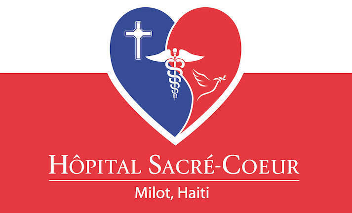

# Hôpital Sacré Coeur distribution

>Hôpital Sacré Coeur (HSC) is the largest private hospital in the North of Haiti. Located in the town of Milot, Haiti the 200 bed hospital has provided uninterrupted service for almost 30 years.
><br>This premier Haitian healthcare facility has been a beacon of hope for the people of Northern Haiti as it creates a healthier Haiti, one dignified life at a time.
><br>
><br>http://crudem.org

-----

This repository maintains the 'distro POM' for the _HSC distribution_.

It downloads and brings in one place all artifacts needed by the distribution, simply run:
```
mvn clean package
```
### Target inventory:

* `bahmni_emr/`
<br/>The target version of the front-end apps that makes 'Bahmni EMR'.
* `bahmni_config/`
<br/>The bespoke Bahmni configuration (more [here](https://github.com/CRUDEM/bahmni-config-hsc)) to be consumed by Bahmni Apps.
* `openmrs_modules/`
<br/>The required set of OpenMRS modules.
* `openmrs_config/`
<br/>The OpenMRS bespoke configuration (more [here](https://github.com/CRUDEM/openmrs-config-hsc)) to be processed by the [Initializer module](https://github.com/mekomsolutions/openmrs-module-initializer).
* `openmrs_core/`
The target version of OpenMRS Core.

## Release Notes

### Version 1.7.0
* Fixed  lab test datatypes, from Free Text to Numeric.
* Added Odoo Sale Delivery Status add-on.
* Added Odoo Sale Payment Status add-on.

### Version 1.6.1
* Fixed lab tests with changed uuids

### Version 1.6.0
* Fixed error on the HSC Dev clinical app occurred when logged in with FR locale.
* Added missing Metronidazole to EMR.
* Added Widal’s and Zeihl to the Blood sample.
* Added Filariasis to blood sample type
* Added procedures for new maxillofacial surgical procedures.
* Changed Spironolactone 50mg Units to Comprime(s).
* Added consultation 'Odontology' in Odoo.
* Added Direct and Indirect Bilirubin Lab Tests.
* Added Decapuchonnage (Odontology) Service.
* Added Additional Instructions to the quotation line.
* Updated Distro Haiti to use the Most Recent Bahmni Apps.
* Added new chief complaints: Douleur ostéo-articulaire, Suivis diabétique, Suivis HTA, Rendez-vous clinique.
* Added ability to cancel quotations in bulk to Odoo.
* Added ability to display patient weight and DOB on Odoo quotation.
* Disabled Odoo's Quotation default filter.
* Added ability to cancel a quotation when no order line is present anymore.
* Enhanced 'New' vs 'subsequent' MSPP visits to be based on the year of visit.
* Changed materials from consumables to stockable products.
* Added ability to display Patient ID on the quotation, order and invoice.
* Stopped recreation of Manufacturing operation types  (for Pharmacy and Warehouse) at server restart.
* Added Weight on Patient banner.
* Reworked patient registration card printout.
